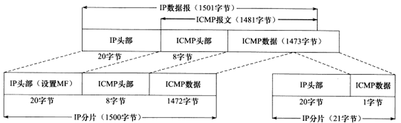
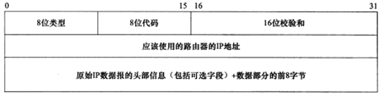
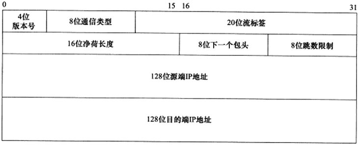

# IP 服务的特点

IP 协议是 TCP/IP 协议族的动力，它为上层协议提供**无状态、无连接、不可靠的服务* **。

## 无状态

IP 通信双方不同步传输数据的状态信息，因此所有 IP 数据报的发送，传输和接收都是相互独立的，没有上下文关系的。这种服务最大的特点就是无法处理乱序和重复的 IP 数据报。

虽然 IP 数据报头部提供了一个标识符字段用以标识一个 IP 数据报，但它是用来处理 IP 分片和重组的，而不是用来指示接收顺序的。

无状态的优点：简单，高效。

## 无连接

IP 通信双方都不长久地维持对方的任何信息，这样上层协议每次发送数据的时候，都必须明确指定对方的 IP 地址。

## 不可靠

不可靠是指 IP 协议不能保证 IP 数据报准确地到达接收端，它只是承诺尽最大努力送达。发送端 IP 模块一旦检测到 IP 数据报发送失败，就通知上层协议发送失败，而不会试图重传。因此使用 IP 服务的上层协议需要自己实现数据确认，超时重传等机制以达到可靠传输的目的。

很多情况都能导致 IP 数据报发送失败，比如某个中转路由器发现 IP 数据报在网络上存活时间太久了，它将丢弃之，并返回一个 ICMP 错误信息给发送端。

# IPv4 头部

Ipv4 头部长度通常为 20 字节，除非含有可变长的选项部分。


- 4 位版本号：指定 IP 协议的版本，对 IPv4 来说是 4。

- 4 位头部长度：标识该 IP 头部有多少个 32 bit 字(4字节)。因为 4 位最大能表示 15，所以 IP 头部最长是 60 字节。

- 8 位服务类型(TOS，Type of Service)：

  - 包括一个 3 位优先权字段(现在已经被忽略)
  - 4 位的 TOS 字段分别表示：最小延时，最大吞吐量，最高可靠性，最小费用。其中最多有一个能置1，应用程序应该根据实际需要来设置。例如 ssh 和 telnet 需要最小延迟服务，ftp 需要最大吞吐量服务。

- 16 位总长度：整个 IP 数据报的长度，以字节为单位，IP 数据报的最大长度为 65535 字节，但是由于 MTU 的限制，长度超过 MTU 的数据将被分片传输，所以实际传输的 IP 数据报的长度都远远没有达到最大值。

- 16 位标识：唯一的标识主机发送的每一个数据报，其初始值由系统随机生成，每发送一个数据报，其值就加1，该值在数据报分片时被复制到每个分片中，因此同一个数据报的所有分片具有相同的标识值。

- 3 位标志字段：

  - 第一位：保留。
  - 第二位：标识禁止分片，如果设置了这个位，IP 模块将不对数据报进行分片，这种情况下，如果 IP 数据报长度超过 MTU 的话，IP 模块将丢弃该数据报并返回一个 ICMP 差错报文。
  - 第三位：表示更多分片，除了数据报的最后一个分片外，其它分片都要把它设置为 1。

- 13 位分片偏移：分片相对原始 IP 数据报开始处(仅指数据部分)的偏移，实际的偏移值是该值左移 3 位(乘8)后得到的，由于这个原因，除了最后一个 IP 分片外，每个 IP 分片的数据部分长度必须是 8 的整数倍，这样才能保证后面的 IP 分片拥有一个合适的偏移量。

- 8 位生存时间(Time To Live，TTL)：是数据报到达目的地之前允许经过的路由跳数，TTL 值被发送端设置(常见值是 64)。数据报在转发过程中没经过一个路由，该值就被路由器减1，当 TTL 值减为 0 时，路由器将丢弃数据报，并向源端发送一个 ICMP 差错报文，TTL 值可以防止数据报陷入路由循环。

- 8 位协议：区分上层协议，ICMP 是1，TCP 是 6，UDP 是 17，这些字段定义在 `/etc/protocols` 中。

- 16 位头部校验和：发送端填充，接收端对其使用 CRC 算法检验 IP 数据报头部(仅检验头部)在传输过程中是否损坏。

- 32 位的源端 IP 地址和目的端 IP 地址用来标识数据报的发送端和接收端。一般情况下，这两个地址在整个数据报的传递过程中保持不变，而不论中间经过多少次路由器。

- 可变长的可选信息：这部分最多包含40 字节，因为 IP 头部最长是 60 字节，其中 20 字节是固定部分，可用的 IP 选项包括：

  - 记录路由：告诉数据报途径的所有路由器都将自己的 IP 地址填入 IP 头部的选项部分，这样可以跟踪数据报的传递路径。
  - 时间戳：告诉路由器将数据报被转发的时间(或时间与IP地址对)填入 IP 头部的选项部分这样就可以测量途径路由之间的数据报传输的时间。
  - 松散路由选择：指定一个路由器 IP 地址列表，数据报发送过程中必须经过其中所有的路由器。
  - 严格路由选择，跟松散路由选择类似，不过数据报只能经过指定的路由器。

  ## tcpdump 查看 IPv4 头部结构

  ```
  sudo tcpdump -ntx -i lo # 抓取本地回路上的数据包
  telnet 127.0.0.1
  ```

  结果：

  ```
  IP 127.0.0.1.45884 > 127.0.0.1.23: Flags [S], seq 1456612487, win 65495, options [mss 65495,sackOK,TS val 4020020091 ecr 0,nop,wscale 7], length 0
          0x0000:  4510 003c dbe8 4000 4006 60c1 7f00 0001
          0x0010:  7f00 0001 b33c 0017 56d2 2487 0000 0000
          0x0020:  a002 ffd7 fe30 0000 0204 ffd7 0402 080a
          0x0030:  ef9c a37b 0000 0000 0103 0307
  ```

  此数据包共 60 字节，其中 IP 头部 20 字节，TCP 头部 40 字节。不包含应用程序数据(length 的值为0)。

| 十六进制数  | 十进制数 |               IP 头部信息                |
| :---------: | :------: | :--------------------------------------: |
|    0x04     |    4     |             IP 版本号，Ipv4              |
|    0x05     |    5     | 头部长度为 5 个 4 字节，也就是 20 个字节 |
|    0x10     |          |        TOS 选项最小延迟服务被开启        |
|   0x003c    |    60    |           数据报总长度 60 字节           |
|   0xdbe8    |          |                数据报标识                |
|    0x04     |          |            设置了禁止分片标志            |
|    0x000    |    0     |                 分片偏移                 |
|    0x40     |    64    |             TTL 被设置为 64              |
|    0x06     |    6     |  协议字段为 6，表示上层协议是 TCP 协议   |
|   0x60c1    |          |              IP 头部检验和               |
| 0x7f00 0001 |          |       32 位源端 IP 地址 127.0.0.1        |
| 0x7f00 0001 |          |      32 位目的端 IP 地址 127.0.0.1       |

# IP  分片

IP 数据报的长度超过帧的 MTU 时，将被分片传输。

- 分片可能出现在发送端，也可能出现在中转路由器上，传输过程中可以被多次分片。
- 只有在最终的目标机器上，这些分片才会被内核中的 IP 模块重新组装。

IP 头部给 IP 分片和重组提供的信息：

- 数据报标识：一个 IP 数据报的每个分片都具有自己的 IP 头部标识，他们具有相同的标识值。
- 标志：除了最后一个分片之外，其他分片都将设置 MF 标志。
- 片偏移：每个分片的片偏移是不一样的。

每个分片的 IP 头部的总长度字段将被设置为该分片的长度。

```
sudo tcpdump  -ntv -i enp3s0 icmp # 只抓取 ICMP 报文
ping 192.168.1.59 -s 1473 # -s 指定每次发送的字节数
```

结果：

```
tcpdump: listening on enp3s0, link-type EN10MB (Ethernet), capture size 262144 bytes
IP (tos 0x0, ttl 64, id 15424, offset 0, flags [+], proto ICMP (1), length 1500)
    192.168.1.100 > 192.168.1.59: ICMP echo request, id 5983, seq 1, length 1480
IP (tos 0x0, ttl 64, id 15424, offset 1480, flags [none], proto ICMP (1), length 21)
    192.168.1.100 > 192.168.1.59: ip-proto-1
```

- IP 分片的标识值都是 15424，说明它们是同一个 IP 数据报的分片。
- 第一个分片的偏移值是0，而第二个分片的偏移则是 1480，显然是第一个分片的 ICMP 报文长度。
- 第一个分片设置了 MF 标志 `flags [+]`，表示还有后续分片。第二个分片没有任何标志 `flags [none]`。
- 这两个分片的总长度分别是 1500 字节和 21 字节。



# IP 路由

IP  协议的一个核心任务是数据报的路由，即决定发送数据报到目标机器的路径。

## IP 模块工作流程


IP 模块接收到来自数据链路层的 IP 数据报时：

- 对数据报头部进行 CRC 校验，确认无误之后就分析其头部的具体信息。
- 如果 IP 数据报的头部设置了源站选路选项(松散源路由选择和严格源路由选择)，则 IP 模块调用数据报转发子模块来处理该数据报。
- 如果 IP 数据报的头部目标地址是本机的 IP 地址或者广播地址，即该数据报是发送给本机的，则 IP 模块就根据数据报头部的协议字段来决定将它派发给哪个上层应用。
- 如果 IP 模块发现这个数据报不是发送给本机的，则也调用数据报转发子模块来处理该数据报。
- 数据报转发子模块首先检测系统系统是否允许转发
  - 如果不允许，IP 模块就将数据报丢弃。
  - 如果允许，数据报转发子模块将对该数据报执行一些操作，然后将它交给 IP 数据报输出子模块。
- IP 数据报应该发送至哪个下一跳理由或者目标主机，以及经过哪个网卡来发送，就是 IP 路由过程，IP 模块实现数据报路由的核心数据结构是路由表，这个表将按照数据报的目标 IP 地址分类，同一类型的 IP 数据报将被发往相同的下一跳路由表或者目标机器。
- IP 输出队列中存放的是所有等待发送的 IP 数据报，其中除了需要转发的 IP 数据报之外，还包括封装了本机上层数据的 IP 数据报。

虚线部分显示了路由表更新的过程，这一过程是指通过路由协议或者 route 命令来调整路由表，使之适应最新的网络拓扑结构，称为 IP 路由策略。

## 路由机制

使用 route 或者 netstat 命令可以查看路由表。

 ```
route  # 或者使用 netstat -r


Kernel IP routing table
Destination     Gateway         Genmask         Flags Metric Ref    Use Iface
default         bogon           0.0.0.0         UG    100    0        0 enp3s0
link-local      *               255.255.0.0     U     1000   0        0 enp3s0
172.17.0.0      *               255.255.0.0     U     0      0        0 docker0
192.168.0.0     *               255.255.255.0   U     0      0        0 br-8a543cb1321f
192.168.1.0     *               255.255.255.0   U     100    0        0 enp3s0
 ```

|    字段     |                             含义                             |
| :---------: | :----------------------------------------------------------: |
| Destination |                        目标网络或主机                        |
|   Gateway   |      网关地址，* 表示目标和本机在同一个网络，不需要路由      |
|   Genmask   |                           网络掩码                           |
|    Flags    | 路由项标志，常见的：<br/> U：该路由项是活动的 <br/>H：该路由项的目标是一台主机 <br/>G：该路由项的目标是网关 <br/>D：该路由项是由重定向生成的 <br/>M：该路由项被重定向修改过 |
|   Metric    |             路由距离，即到达指定网络需要的中转数             |
|     Ref     |                路由项被引用次数(linux 未使用)                |
|     Use     |                      该路由项被引用次数                      |
|    Iface    |                  该路由项对应的输出网卡接口                  |

IP 路由机制：

- 查找路由表中和数据报的目标 IP 地址完全匹配的主机 IP 地址，如果找到就使用该路由项。
- 如果上述过程没有找到，查找路由表中和数据报的目标 IP 地址具有相同网路 ID 的网络 IP 地址，如果找到了使用该路由项。
- 如果上述过程没有找到，选择默认路由项，这通常意味着数据报的下一跳是网关。

## 路由表更新

路由表必须更新，以反映网络连接的变化。这样 IP 模块才能准确高效地转发数据报。

使用 route 命令修改路由表：

```
sudo route add -host 192.168.1.109 dev eth0  # 添加主机 192.168.1.109 对应的路由项
sudo route del -net 192.168.1.10 netmask 255.255.255.0 # 删除 192.168.1.109 对应的路由项
sudo route del fefault  # 删除默认路由项
sudo route add default gw 192.168.1.109 dev eth0 # 设置默认路由项
```

通过 route 命令或其他工具手工修改路由表，是静态的路由更新方式。

对于大型路由器，它们通过 BGP(Border Gateway Protocol，边际网关协议)，RIP(Routing Information Proctocol，路由信息协议)，OSPF 等协议来发现路径，并更新自己的路由表。这种更新的方式是动态的，自动的。

# IP 转发

不是发送给给主机的 IP 数据报将由路由数据报子模块来处理，路由器都能执行数据报的转发操作，而主机一般只发送和接收数据报。这是因为主机上 `/proc/sys/net/ipv4/ip_forward`  内核参数默认被设置为 0。

可以手动修改：

```
echo 1 > /proc/sys/net/ipv4/ip_forward
```

对于允许 IP 数据报转发的主机或路由器，数据报转发子模块将期望转发的数据报执行：

- 检查数据报头部的 TTL 值，如果 TTL 值已经是 0，则丢弃该数据报。
- 查看数据报头部的严格源路由选择选项。如果该选项被设置，则检测数据报的目标 IP 地址是否是本机的某个 IP 地址。如果不是，则发送一个 ICMP 重定向报文，以告诉它一个更合理的下一跳路由器。
- 将 TTL 值减 1。
- 处理 IP 头部选项。
- 如果有必要，则执行 IP分片。

# 重定向

## ICMP 重定向报文

格式：



ICMP   重定向报文的类型值是 5，代码字段有 4 个可选值，用来区分不同的重定向类型，其中主机重定向的的代码值是 1。

ICMP 重定向报文的数据部分含义很明确，它给接收方提供了如下两个信息：

- 引起重定向的 IP 数据报的源端 IP 地址。
- 应该使用的路由器的 IP 地址。

接收主机根据这连个信息就可以断定引起重定向的 IP 数据报应该使用哪个路由器来转发，并且以此更新路由表(通常是更新路由表缓冲，而不是直接更改路由表)。

`/proc/sys/net/ipv4/conf/all/send_redirects` 内核参数指定是否允许发送 ICMP 重定向报文。

`/proc/sys/net/ipv4/conf/all/accept_redirects` 内核参数指定是否允许接收 ICMP 重定向报文。

一般主机只能接收 ICMP 重定向报文，路由器只能发送 ICMP 重定向报文。

# IPv6 头部结构

## IPv6 固定头部结构

IPv6 头部由 40 字节的固定头部和可变长的扩展头部组成。



- 4 位版本号：指定 IP 协议的版本，对 IPv6 来说，其值是 6。

- 8 位通信类型：指示数据流通信类型或优先级，和 IPv4 中的 TOS 类似。

- 20 位流标签：IPv6 新增加的字段，用于某些对连接的服务质量有特殊要求的通信，比如音视频等实时采集数据传输。

- 16 位净荷长度：IPv6 扩展头部和应用程序数据长度之和，不包括固定头部长度。

- 8 位下一个包头：指出紧跟 IPv6 固定头部后的包头类型，如扩展头(如果有的话)或某个上层协议头(TCP，UDP，ICMP)，类似于 IPv4 头部中的协议字段，且相同的取值有相同的含义。

- 8 位跳数限制：和 IPv4 中的 TTL 含义相同。

- IPv6 使用 128 位来表示 IP 地址，使得 IP 地址的总量达到了  `2^128`   个。

  

IPv6 地址的表示：

```
"FE80:0000:0000:0000:1234:5678:0000:0012" # 16 进制表示
"FE80::1234:5678:0000:0012"  # 零压缩表示，只能压缩一次，::之间省略的都是0
```

## IPv6 扩展头部

可变长的扩展头部使得 IPv6 能支持更多的选项，并且很方便将来的扩展需要。

它的长度可以是0，表示数据报没有使用任何扩展头部，一个数据报可以包含多个扩展头部，每个扩展头部的类型由前一个头部中的下一个报头字段指定。

目前可以使用的扩展头部：

|            扩展头部            |                             含义                             |
| :----------------------------: | :----------------------------------------------------------: |
|           Hop-by-Hop           | 逐跳选项头部，它包含每个路由器都必须检查和处理的特殊参数选项。 |
|      Destination options       |          目的选项头部，指定由最终目的节点处理的选项          |
|            Routing             | 路由头部，指定数据报要经过哪些中转路由器，功能类似于 Ipv4 的松散源路由选择选项和记录路由选项 |
|            Fragment            |                分片头部，处理分片和重组的细节                |
|         Authentication         |     认证头部，提供数据源认证，数据完整性检查和反重播保护     |
| Encapsulating Security Payload |                    加密头部，提供加密服务                    |
|         No next header         |                       没有后续扩展头部                       |

IPv4 数据报的以太网帧类型值是 0x0800。

IPv6 数据报的以太网帧类型值是 0x0086。


