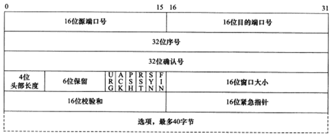
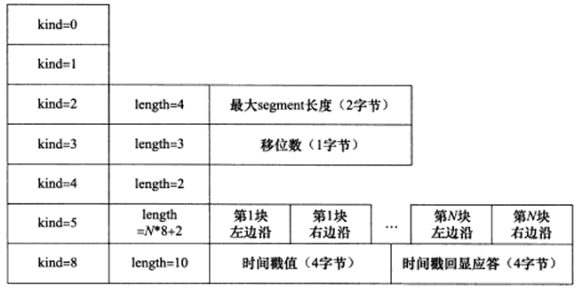

# TCP 服务特点

TCP 协议的特点：面向连接、字节流、可靠传输。

## 面向连接

使用 TCP 协议通信的双方必须先建立连接，然后才开始读写数据。

- 双方必须为连接分配必要的内核资源，以管理连接的状态和连接上的数据传输。
- TCP 连接是全双工的，即双方的数据读写都可以通过一个连接进行。
- 完成数据交换后，通信双方必须断开连接以释放系统资源。
- TCP 协议的这种连接是一对一的，所以基于广播和多播的应用程序不能使用 TCP 服务，UDP 则适合用于广播和多播。

## 字节流

字节流服务和数据报服务的区别对应到实际编程时则体现为通信双方是否必须执行相同次数的读、写操作。

对于 TCP：

- 发送端应用程序连续执行多次写操作时，TCP 模块先将这些数据放入 TCP 发送缓冲区中。当 TCP 模块真正开始发送数据时，发送缓冲区中这些等待发送的数据可能被封装成一个或多个 TCP 报文段发出，因此，TCP 模块发出的 TCP 报文段的个数和应用程序执行写操作的次数之间没有固定的数量关系。
- 当接收端接收到一个或多个 TCP 报文段，TCP 模块先将它们携带的应用程序的数据按照 TCP 报文段的序号依次放入 TCP 接收缓冲区，并通知应用程序读取数据。接收端应用程序可以一次性将 TCP 接收缓冲区中的数据全部读出，也可以分多次读取，这取决于用户指定的应用程序读取缓冲区的大小。因此引用程序执行的读取操作数和 TCP 模块接收到的 TCP 报文段个数之间也没有固定的数量关系。

也就是：发送端执行的写操作次数和接收端执行的读操作次数之间没有任何数量关系，这就是字节流的概念：**应用程序对数据的发送和接收是没有边界限制的。**

对于 UDP：

- 发送端应用程序每执行一次写操作，UDP 模块就将其封装成一个 UDP 数据报并发送之。
- 接收端必须及时针对每一个 UDP 数据报执行读操作，否则就会丢包，并且，如果用户没有指定足够的应用程序缓冲区来读取 UDP 数据，则 UDP 数据将被截断。

## 可靠传输

TCP 协议采用发送应答机制，发送端发送的每个 TCP 报文段都必须得到接收方的应答，才认为这个 TCP 报文段传输成功。

TCP 采用超时重传机制，发送端在发送出一个 TCP 报文段之后启动定时器，如果在定时时间内未收到应答，它将重发报文段。

TCP 会对 TCP 报文段进行重排，整理，再交付给应用层。

# TCP 头部结构

TCP 头部结构出现在每个 TCP 报文段中，用于指定通信的源端端口，目的端端口，管理 TCP 连接等。

## TCP 固定头部结构

- 16 位端口号：告知主机该报文段来自哪里(源端口)以及传给哪个上层协议或应用程序(目的端口)的。进行 TCP 通信时，客户端通常会使用系统自动选择的临时端口号，而服务端则使用知名服务器端口号。
- 32 位序号：一次 TCP 通信(从 TCP 连接建立到断开)过程中某一个传输方向上的字节流的每个字节的编号。
  - 假设主机  A 跟主机  B 进行 TCP 通信，A 发送给 B 的第一个 TCP 报文段中，序号值被系统初始化为某个随机值 ISN(Initial Sequence Number，初始序号值)。那么在该传输方向上(从 A  到 B)，后续的 TCP 报文段中序号值将被系统设置成 ISN 加上该报文段所携带数据的第一个字节在整个字节流中的偏移。例如 TCP 报文段传送的数据是字节流第 1025 ~ 2048 字节，那么该报文段的序号值就是 ISN + 1025。另外一个传输方向(从 B 到 A)的 TCP 报文段的序号值也具有相同的含义。
- 32 位确认号：用作对另一方发送来的 TCP 报文段的响应。其值是收到的 TCP 报文段的序号值加 1。
  - 假设主机 A 和 主机 B 进行 TCP 通信，那么 A 发送的 TCP 报文段不仅携带自己的序号，而且包含对 B 发过来的 TCP 报文段的确认号，反之也是。
- 4 位头部长度：标识该 TCP 头部有多少个 32bit (4字节)。因为 4 位最大能表示 15 所以 TCP 头部 最长是 60 字节。
- 6 位标志位：
  - URG 标志：表示紧急指针是否有效。
  - ACK 标志：表示确认号是否有效，称携带 ACK 标志的 TCP 报文段为确认报文段。
  - PSH 标志：表示接收端应用程序应该立即从 TCP 接收缓冲区中读走数据，为接收后续数据腾出空间(如果应用程序不将接收到的数据读走，它们会一直停留在 TCP 缓冲区中)。
  - RST 标志：表示要求对方重新建立连接，称携带 RST 标志的 TCP 报文段为复位报文段。
  - SYN 标志：表示请求建立一个连接，称携带 SYN 标志的 TCP 报文段为同步报文段。
  - FIN 标志：通知对方本端要关闭连接，称携带 FIN 标志的报文段为结束报文段。
- 16 位窗口大小：TCP 流量控制的一个手段，这里的窗口指的是接收通告窗口，它告诉对方本端的 TCP 接收缓冲区还能容纳多少字节的数据，这样对方就可以控制数据发送的速度。
- 16 位校验和：由发送端填充，接收端对 TCP 报文段执行 CRC 校验，以确认传递过程中是否损坏，这个校验不仅包含 TCP 头部，也包含数据部分，这是 TCP 可靠传输的一个重要保障。
- 16 位紧急指针：是一个正的偏移量。它和序号字段的值相加表示最后一个紧急数据的下一字节的序号。也就是紧急指针相对当前序号的偏移，可以称之为紧急偏移。TCP 的紧急指针是发送端向接收端发送紧急数据的方法。

## TCP 头部选项

TCP 头部的最后一个选项字段是可变长的可选信息。这部分最多包含 40 字节。

kind：说明选项的类型，TCP 选项有 7 种：

- kind = 0：表示结束选项。
- kind = 1：空操作选项，没有特殊含义，一般用于将 TCP 选项的总长度填充为 4 字节的整数倍。
- kind = 2：最大报文段长度选项，TCP 连接初始化时，通信双方使用该选项来协商最大报文段长度(Max Segment Size，MSS)。TCP 报文段通常将 MSS 设置为(MTU-40)字节，减去的 40 字节，包含 20 字节的 TCP 头部，20 字节的 IP 头部。这样携带 TCP 报文段的 IP 数据报的长度就不会超过 MTU(假设 TCP 头部和 IP 头部不包含选项字段，并且这也是一般情况)。从而避免本机发生 IP 分片。对以太网而言，MSS 的值是 1500 - 40 = 1460 字节。
-  kind = 3：窗口扩大因子选项，TCP 连接初始化时，通信双方使用该选项来协商接收通告窗口的扩大因子。在 TCP 头部中，接收通告窗口大小是用 16 位表示的，故最大位 65535 字节，但是实际上 TCP 模块允许的接收通告窗口大小远远不止这个数。窗口扩大因子解决了这个问题，假设 TCP 头部中的接收通告窗口大小是 N，窗口扩大因子(移位数)是M，那么 TCP 报文段的实际接收通告窗口大小是 N 乘以 2^M，或者说是 N 左移 M 位。M 的取值范围是 0-14，可以通过修改 `/proc/sys/net/ipv4/tcp_window_scalling` 内核变量来启用或关闭窗口扩大因子选项。
  - 和 MSS 选项一样，窗口扩大因子选项只能出现在同步报文段中，否则将会被忽略。但同步报文段头部的接收通告窗口大小就是该 TCP 报文段的实际接收通告窗口大小。当连接建立好之后，每个数据传输方向的窗口扩大因子就固定不变了。
- kind = 4：选择性确认选项(Selective Acknowledgement，SACK)。TCP 通信时，如果某个 TCP 报文段丢失，则 TCP 模块会重传最后被确认 TCP 报文段后续的所有报文段。这样原先正确传输的 TCP 报文段也可能重复发送，从而降低  TCP 的性能。SACK 技术正是为了改善这一情况而产生的。它使 TCP 模块只重新发送丢失的 TCP 报文段，不用发送所有未被确认的  TCP 报文段。选择性确认选项用在连接初始化时，表示是否支持 SACK 技术。可以修改  `/proc/sys/net/ipv4/tcp_sack` 内核变量来启用或者关闭选择性确认选项。
- kind = 5：SACK 实际工作的选项，该选项的参数告诉发送方本端已经收到并缓存的不连续的数据块，从而让发送端可以据此检查并重发丢失的数据块。每个块边沿参数包含一个 4 字节的序号。其中块左边沿表示不连续块的第一个数据的序号，而块右边沿则表示不连续块的最后一个数据的的序号的下一个序号，这样一对参数之间的数据没有接收到，因为一个信息块占用 8 字节，所以  TCP 头部选项中实际上最多可以包含 4 个这样的不连续数据块。
- kind = 8：时间戳选项，该选项提供了较为准确的计算通信双方之间的回路时间，从而为 TCP 流量控制提供重要信息。可以修改 `/proc/sys/net/ipv4/tcp_timestamps` 内核变量来启用或关闭时间戳选项。

## tcpdump 观察 TCP 头部信息

# TCP 连接的建立和关闭

