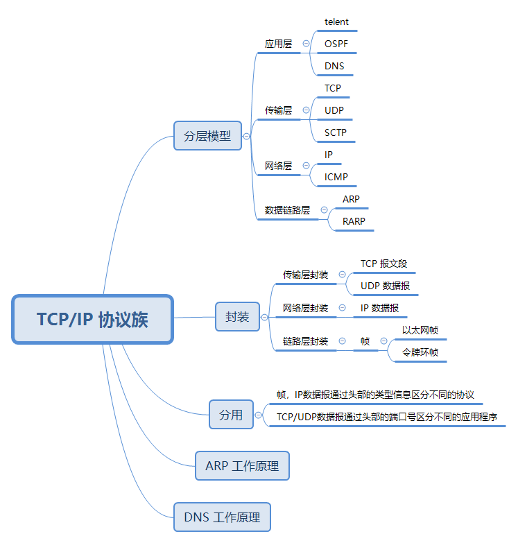

# TCP/IP 协议族体系结构及主要协议

TCP/IP 协议族是一个四层协议系统，每层完成不同的功能，通过若干协议来实现，上层协议使用下层协议提供的服务。

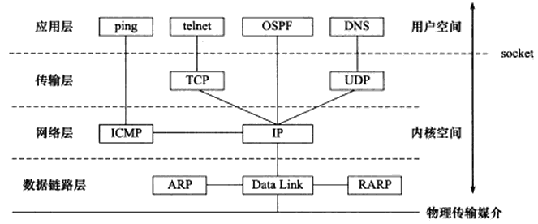

## 数据链路层

数据链路层实现了网卡接口的网络驱动程序，以处理数据再物理媒介(比如以太网，令牌环)上的传输。

不同的物理网络具有不同的电气特性，网络驱动程序隐藏了这些细节，为上层协议提供一个统一接口。

**常用协议：**

- ARP(Address Resolve Protocol，地址解析协议)：将目标机器的 IP 地址转换成其物理地址
  - 因为网络层是使用 IP 地址寻找一台机器，而数据链路层是使用物理地址寻找一台机器，因此网络层必须将 IP 地址转换成其物理地址才能使用数据链路层提供的服务。
- RARP(Reverse Address Resolve Protocol，逆地址解析协议)： 将物理地址转换成IP地址
  - 一些无盘工作站无法记住自己的 IP  地址，但是可以利用网卡上的物理地址来向网络管理者查询自身的 IP 地址。

## 网络层

网络层实现数据包的选路和转发。

广域网通常使用众多分级路由器来连接分散的主机或局域网，因此，通信的两台主机一般不是直接相连的，而是通过多个中间节点(路由器)连接的。网络层的作用就是选择这些中间节点，以确定两台主机之间的通信路径。

网络层对上层协议隐藏了网络拓扑连接的细节，使得传输层和网络层应用程序看来，通信的双方是直接相连的。

**常用协议：**

- IP(Internet Protocol，因特网协议)：IP 协议根据数据包的目的 IP 地址来决定如何投递它。在数据包不能直接发送给目标主机时，IP协议为它寻找合适的吓一跳路由器。并将数据包交给该路由器转发，多次重复上述过程，数据包最终到达目标主机，或者因为发送失败而被丢弃。

- ICMP(Internet Control Message Protocol，因特网控制报文协议)：用于检测网络连接，ICMP 并非严格意义上的网络层协议，因为它使用处于同一层的 IP 协议提供服务，一般来说上层协议应该使用下层协议提供的服务。

## 传输层

传输层为两台主机上的应用程序提供端到端的通信，传输层只关心通信的起始端和目的端，而不在乎数据包的中转过程。

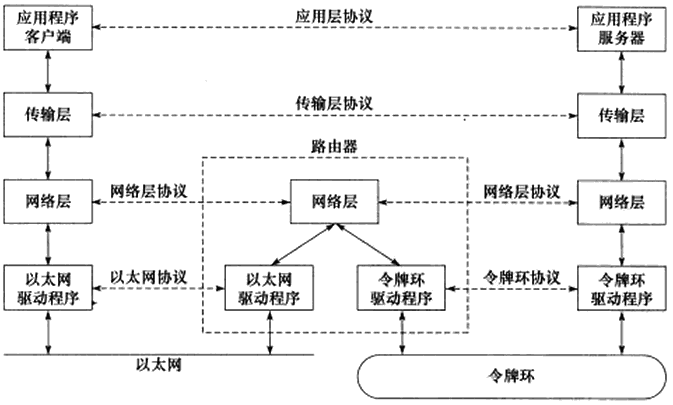

**常用协议：**

- TCP(Transmission Control Protocol，传输控制协议)：为应用层提供可靠的，面向连接的，基于流的服务。
- UDP(User Datagram Protocol，用户数据报协议)：为应用层提供不可靠，无连接，基于数据报的服务。
- SCTP(Stream Control Transmission Protocol，流控制传输协议)：为在因特网上传输电话信号而设计的。

## 应用层

应用层负责处理应用程序的逻辑。应用层在用户空间实现。

**常用协议：**

- telnet：远程登录协议。
- OSPF(Open Shortest Path First，开放最短路径优先协议)： 动态路由更新协议，用于路由器之间的通信，以告知对方各自的路由信息。
- DNS(Domain Name Services，域名服务)：机器域名到 IP 地址的转换。

需要注意的是：

- ping 是应用程序，而不是一种协议，它是利用 ICMP 报文检测网络连接的必备工具。

# 封装

应用程序数据在发送到物理网络之前，将沿着协议栈从上到下依次传递，每层协议都将在上层数据的基础上加上自己的头部(尾部)信息，以实现该层的功能，这个过程称为封装。

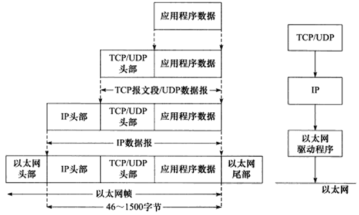

TCP 报文段封装过程：

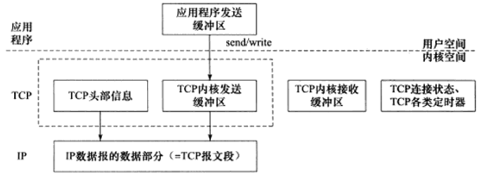

以太网帧封装：

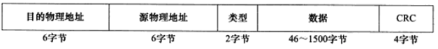

# 分用

当帧到达目的主机时，将沿着协议族自底向上依次传递，各层协议依次处理帧中本层负责的头部数据，以获取所需的信息，并将最终处理后的帧交给应用程序。这个过程称为分用。

分用是依靠头部信息中的类型字段实现的。标准文档 RFC 1700 定义了所有标识上层协议的类型字段以及每个上层协议对应的数值。

以太网帧分用：

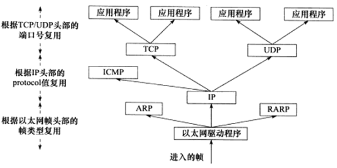

以太网帧使用 16 位 字节的类型字段来标识上层协议：

- 0x0800：IP 数据报
- 0x0806：ARP 请求或应答报文
- 0x0835：RARP 请求或应答报文

IP 数据报头部采用 16 位的协议字段来区分协议： TCP，UDP，ICMP

TCP 报文段和 UDP 报文段则是通过头部的 16 位的端口号来区分上层应用程序：

- 53：DNS
- 80：Http

帧的最大传输单元(Max Transmit Unit，MTU) 即帧最多能带上多少上层协议数据，此数值受到 网络类型的限制，以太网帧的 MTU 值是 1500。IP 数据报过长时将被分片传输。

# ARP 协议工作原理

ARP 协议实现任意网络层地址到任意物理地址的转换。

主机向自己的网络广播一个 ARP 请求，该请求包含目标主机的 IP 地址，此网络上的其他机器都将收到这个请求，但只有被请求的目标机器会回应一个 ARP 应答，其中包含了自己的物理地址。

## 以太网 ARP 请求/应答报文

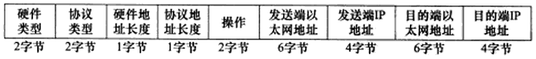

- 硬件类型字段：物理地址类型，1 表示 MAC 地址。
- 协议类型字段：要映射的协议地址类型，0x8000 表示 IP 地址。
- 硬件地址长度字段和协议地址长度字段，其单位是字节，对 MAC 地址来说，其长度是 6，对 IPv4 地址来说，其地址长度是 4。
- 操作字段：1 表示 ARP 请求，2 表示 ARP 应答，3 表示 RARP 请求，4 表示 RARP 应答。

ARP 请求/应答报文的长度是 28 字节，如果再加上以太网帧头部和尾部的 18 字节，ARP 请求/应答报文的以太网帧共计 46 字节，但是有些实现中要求 ARP 报文的长度至少是 46 字节，ARP 请求/应答报文的以太网帧共计 64字节。

## ARP 高速缓存的查看和修改

ARP 维护一个高速缓存，其中包含经常访问(比如网关地址)或最近访问的机器的 IP 地址到物理地址的映射。 这样就避免了重复的 ARP 请求。

```
arp -a # 查看 arp 缓存
sudo arp -d IP # 删除一条 arp 缓存
sudo arp -s IP MAC # 增加一条 arp 缓存
```

## tcpdump 观察 ARP 通信过程


# DNS 工作原理

DNS 是一套分布式的域名服务系统，每个 DNS 服务器上都存放着大量的机器名 和 IP 地址的映射，并且是动态更新的。

DNS 查询和应答报文：

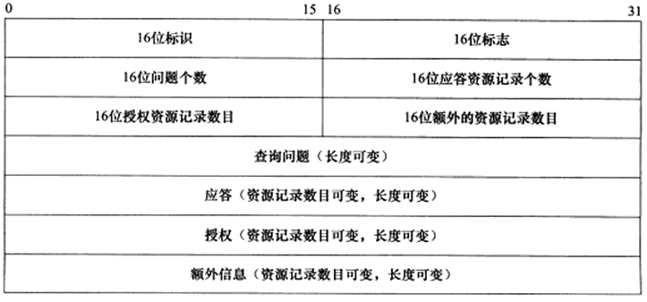

- 标识字段：标记一对 DNS 查询和应答，以此区分一个 DNS 应答是哪个  DNS 查询的回应。
- 标志字段：协商具体的通信方式和反馈通信状态：
  - QR：0 表示查询报文，1 表示应答报文
  - opcode：定义查询和应答的类型，0 表示标准查询，1 表示反向查询(由IP地址获取主机域名)，2 表示请求服务器状态
  - AA：授权应答标志，仅有应答报文使用，1 表示域名服务器是授权服务器
  - TC：截断标志，仅当 DNS 报文使用 UDP 服务时使用，因为 UDP 数据报有长度限制，所以过长的 DNS 报文将被截断。1 表示 DNS 超过 512 字节，被截断。
  - RD：递归查询标志，1 表示执行递归查询：如果目标 DNS 服务器无法解析某个主机名，则它将向其他 DNS 服务器继续查询，如此递归，直到获得结果并返回给客户端。0 表示执行迭代查询：如果目标 DNS 服务器无法解析某个主机名，则它将自己知道的其他 DNS 服务器的 IP 地址返回给客户端，以供客户程序参考。
  - RA：允许递归标志，仅有应答报文使用，1 表示 DNS 服务器支持递归查询。
  - zero：这 3 位未用，必须都设置为0。
  - rcode：表示应答状态，0 表示无错误，3 表示域名不存在。

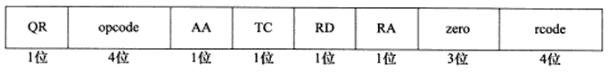

- 接下来的4个字段分别指出 DNS 报文的最坏 4 个字段的资源记录数目：
  - 查询报文：一般包含 1 个查询问题，应答资源记录数，授权资源记录数和额外资源记录数则为0 。
  - 应答报文：应答资源记录数至少为1，而授权资源记录数和额外资源记录数可为0或非0。
- 查询问题的格式
  -  查询名：以一定的格式封装了要查询主机的域名
  - 查询类型：类型 A 的值是 1 表示要获取目标主机的 IP 地址；类型 CNAME 的值是 5，表示获取目标主机的别名；类型 PTR 的值是 12 表示反向查询。
  - 查询类：通常为1，表示获取 IP 地址。

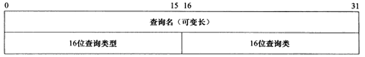

- 应答字段，授权字段和额外信息字段都使用资源记录。
  - 域名：该记录中与资源对应的名字，其格式和查询问题中的查询名字段相同。16 位类型和 16 位类字段的含义也与 DNS 查询问题的对应字段相同。
  - 资源数据长度和资源数据长度字段的内容取决于类型字段，对类型 A 而言，资源数据是 32 位的 IPv4地址，而资源数据长度则为4(以字节为单位)。

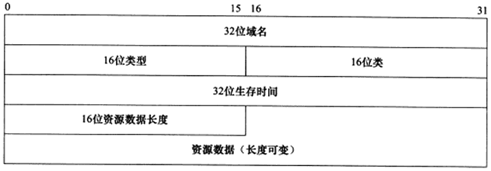

## 使用 tcpdump 观察 DNS 的通信过程

linux 下常用访问 DNS 服务器的客户端程序是 host，例如：

```
sudo host -t A www.baidu.com # -t 表示查询类型，这里是 A 类型
```

结果：

```
$ host -t A www.baidu.com
www.baidu.com is an alias for www.a.shifen.com. # 是别名
www.a.shifen.com has address 220.181.38.150  # 对应两个 IP 地址
www.a.shifen.com has address 220.181.38.149
```

tcpdump 抓包：

```
sudo tcpdump -i enp3s0 -nt -s 500 port domain  # port domain 只抓取域名服务的数据包，即 DNS 查询和应答报文
sudo host -t A www.baidu.com
```

结果：

```
listening on enp3s0, link-type EN10MB (Ethernet), capture size 500 bytes
IP 192.168.1.59.35815 > 192.168.1.1.53: 702+ A? www.baidu.com. (31)
IP 192.168.1.1.53 > 192.168.1.59.35815: 702 3/0/0 CNAME www.a.shifen.com., A 220.181.38.149, A 220.181.38.150 (90)
```

- 第一个是主机向  DNS 服务器发送 DNS 查询报文的数据报，目标端口是 53。
  - 702 是查询的标识值，因此在反馈报文中也有。
  - \+ 标识采用递归查询。
  - A 标识查询的方式。
  - 31 表示 DNS 查询报文长度.
- 第二个是DNS 服务器向目标主机反馈的 DNS 应答报文。
  - 3/0/0 表示报文包含 3  个应答资源记录，0 个授权资源记录，0  个额外信息记录。
  - CNAME www.a.shifen.com, A 220.181.38.149, A 220.181.38.150 表示 3 个应答记录的内容

# socket 和 TCP/IP

socket 定义了一组 API，提供对数据链路层，网络层，传输层协议的访问：

- 将应用程序数据从用户缓冲区中复制到 TCP/UDP 内核发送缓冲区，以交付内核来发送数据，或者从内核 TCP/UDP 接收缓冲区中复制到用户缓冲区，以读取数据。
- 应用程序可以通过它们来修改内核中各层协议的某些头部信息或起他数据结构，从而精细地控制底层通信的行为。

值得一提的是，socket 是一套通用网络编程接口，它不但可以访问内核中 TCP/IP 协议栈，而且可以访问其它网络协议栈(X.25 协议栈，UNIX 本地域协议栈)。

